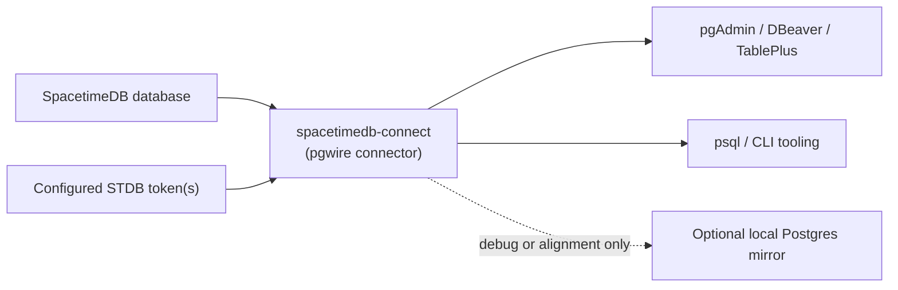

# spacetimedb-connect

`spacetimedb-connect` is a SpacetimeDB connector that lets existing PostgreSQL UIs and CLI tools work against SpacetimeDB through a pgwire-compatible surface.



Day-to-day usage is pgwire-first:

- point the UI or CLI at the connector, not at a local Postgres instance
- local Postgres is not required for normal use
- the connector uses configured `STDB_AUTH_TOKEN` / `STDB_ADMIN_AUTH_TOKEN` to talk to SpacetimeDB
- reducer/procedure support is a work in progress; metadata exposure exists today, while parameter fidelity, `CALL`, and richer inspector support are still being built

The examples below use placeholder database names such as `example-app-db`.
The live integration tests in this repo currently run against an FMS-GLM environment, but the connector itself is intended to discover and bridge general SpacetimeDB databases.

## Pgwire-first MVP

If you want to connect a SQL tool directly to SpacetimeDB, the pgwire server is the primary path:

- SpacetimeDB database: `example-app-db`
- Client connection database: `postgres` for metadata or any discovered source database such as `example-app-db`

The pgwire server lets normal Postgres clients connect without materializing row copies first.

- Host: `127.0.0.1`
- Port: `45434`
- Example saved-connection values: user `shim`, password `shim`
- Database: `postgres` for metadata or any discovered source database such as `example-app-db`

Client-side username/password fields are placeholder values for Postgres tools today.
Actual upstream access to SpacetimeDB is controlled by the connector using the configured SpacetimeDB token values.

Current pgwire scope:

- basic PostgreSQL startup/session handshake for client compatibility
- `pg_database` database listing
- `information_schema.tables`
- `information_schema.columns`
- routine metadata surfaced through `information_schema.routines` and `pg_proc`
- `SELECT`
- authorized `INSERT`, `UPDATE`, and `DELETE`
- simple query protocol
- extended query protocol
- parameter interpolation for extended-query reads and writes
- client-side fallback for `ORDER BY`, `LIMIT`, `OFFSET` when Spacetime SQL does not support them directly
- compatibility handling for common `BEGIN`, `COMMIT`, `SET`, and `SHOW` probes from Postgres clients

Not supported yet:

- correct reducer/procedure parameter exposure across SQL clients
- `CALL`
- procedure body/code display in client property inspectors
- `RETURNING`
- DDL and admin statements such as `CREATE`, `ALTER`, `DROP`, `TRUNCATE`, `COPY`, and `CALL`
- full PostgreSQL catalog compatibility
- joins across databases
- full DDL/transaction semantics

## Why this shape

This keeps the user workflow simple:

- reuse familiar SQL UIs and CLI tools instead of building a custom browser for every SpacetimeDB app
- keep the primary path focused on direct SpacetimeDB access through the connector
- reserve local Postgres comparison for debugging or alignment work only

Database discovery is generic:

- first, use `spacetime list` against the configured runtime to get database identities
- then resolve each identity through `GET /v1/database/:identity/names`
- if discovery is incomplete or unavailable, provide explicit names with `STDB_DATABASES`

## Quick start

1. Copy `.env.example` to `.env`
2. Fill in `STDB_AUTH_TOKEN`
   Optional:
   - `STDB_ADMIN_AUTH_TOKEN` for DML if it differs from the read token
   - database-specific `*_DB` / `*_TOKEN` pairs in `~/.secure/.env`
3. Install dependencies:

```bash
npm install
```

4. Run the pgwire server:

```bash
npm run serve:pgwire
```

5. Optionally validate discovery against the live source:

```bash
npm run test:live
```

6. List all currently discovered databases:

```bash
npm run list-databases
```

## Notes

- This does not emulate full PostgreSQL wire-protocol semantics.
- The pgwire path can pass through direct table `INSERT`, `UPDATE`, and `DELETE` statements when the configured SpacetimeDB token is authorized for DML on the target database.
- The pgwire path does not yet synthesize PostgreSQL `RETURNING` result sets or broader DDL/admin semantics.
- Table discovery comes from Spacetime system tables, specifically `st_table`.
- Database discovery is generic and comes from `spacetime list` plus the HTTP names endpoint.
- `STDB_DATABASES=db_a,db_b` can be used as an explicit override or supplement when needed.
- The shim loads `~/.secure/.env` as a fallback secret source and recognizes paired `*_DB` / `*_TOKEN` entries for per-database auth mapping.
- If `STDB_ADMIN_AUTH_TOKEN` is present, the shim prefers it for DML while keeping the normal token path for reads.
- Use `SHIM_INCLUDE_TABLES=table_a,table_b` or `SHIM_EXCLUDE_TABLES=table_c,table_d` to narrow sync-oriented discovery work when needed.
- The pgwire server currently listens on `PGWIRE_HOST` / `PGWIRE_PORT` and is intended for live database tooling first.
- Footnote for debugging/alignment only: if you want a local Postgres copy to compare against SpacetimeDB behavior, start Postgres with `npm run postgres:up` and use `npm run sync` or `npm run sync-all`.
- In that optional mirror mode, the shim recreates tables in Postgres, mirrors every `user` + `public` table by default, and adds `_shim_source_database`, `_shim_synced_at`, and `_shim_row_hash` metadata columns.
