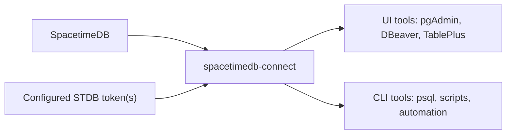

# spacetimedb-connect

`spacetimedb-connect` lets teams use familiar PostgreSQL tools against SpacetimeDB.

Instead of building a separate admin UI for every database, you run this connector, point your existing UI or CLI at it, and work with SpacetimeDB through a PostgreSQL-compatible connection surface.



## Why use it

- use standard PostgreSQL clients with SpacetimeDB
- inspect databases, tables, columns, and routine metadata from familiar tools
- run `SELECT` queries and, when the configured token allows it, direct `INSERT`, `UPDATE`, and `DELETE`
- give developers and operators a practical way to explore live SpacetimeDB systems without building bespoke tooling first

Under the hood, the connector exposes a pgwire-compatible surface. For normal day-to-day use, local Postgres is not required.

## Quick start

1. Copy `.env.example` to `.env`
2. Set `STDB_AUTH_TOKEN`
   Optional:
   - `STDB_ADMIN_AUTH_TOKEN` if write access uses a different token
   - database-specific `*_DB` / `*_TOKEN` pairs in `~/.secure/.env`
3. Install dependencies:

```bash
npm install
```

4. Start the connector:

```bash
npm run serve:pgwire
```

5. Connect your SQL tool or CLI:

- Host: `127.0.0.1`
- Port: `45434`
- User: `shim`
- Password: `shim`
- Database: `postgres` for metadata or any discovered source database such as `example-app-db`

Client-side username and password fields are placeholder values for PostgreSQL tools today.
Actual upstream access to SpacetimeDB is controlled by the configured `STDB_AUTH_TOKEN` and optional `STDB_ADMIN_AUTH_TOKEN`.

## Current status

Works today:

- database discovery
- table and column introspection
- routine metadata surfaced through `information_schema.routines` and `pg_proc`
- `SELECT`
- authorized `INSERT`, `UPDATE`, and `DELETE`
- simple and extended query protocols
- compatibility handling for common `BEGIN`, `COMMIT`, `SET`, and `SHOW` probes from PostgreSQL clients

Work in progress:

- correct reducer/procedure parameter exposure across SQL clients
- `CALL`
- displaying reducer/procedure code in client property inspectors
- `RETURNING`
- broader PostgreSQL catalog, admin, and DDL compatibility

Reducer/procedure support should be treated as an active work-in-progress surface rather than finished PostgreSQL procedure emulation.

## Discovery and configuration

Database discovery is generic:

- use `spacetime list` against the configured runtime to get database identities
- resolve identities through `GET /v1/database/:identity/names`
- use `STDB_DATABASES=db_a,db_b` if you want to provide explicit names

The examples in this repo use placeholder database names such as `example-app-db`.
The current live integration tests happen to target an FMS-GLM environment, but the connector itself is intended for general SpacetimeDB databases.

## Optional debugging footnote

If you want to compare connector behavior against a local Postgres instance for debugging or alignment work, there is an optional mirror path using `npm run postgres:up`, `npm run sync`, and `npm run sync-all`.

That is a developer aid, not a normal runtime requirement for users of this connector.

## Notes

- This does not emulate full PostgreSQL semantics.
- Table discovery comes from Spacetime system tables, specifically `st_table`.
- If `STDB_ADMIN_AUTH_TOKEN` is present, the connector prefers it for DML while keeping the normal token path for reads.
- The shim loads `~/.secure/.env` as a fallback secret source and recognizes paired `*_DB` / `*_TOKEN` entries for per-database auth mapping.
