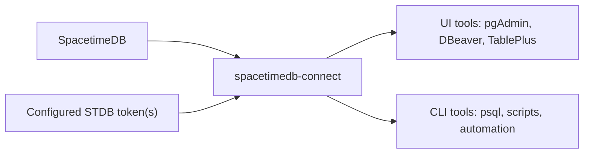

# spacetimedb-connect

`spacetimedb-connect` lets teams use familiar PostgreSQL tools against SpacetimeDB v2.0 onwards.

Instead of building a separate admin UI for every database, you run this connector, point your existing UI or CLI at it, and work with SpacetimeDB through a PostgreSQL-compatible connection surface.



## Why use it

- use standard PostgreSQL clients with SpacetimeDB
- inspect databases, tables, columns, and routine metadata from familiar tools
- run `SELECT` queries and, when the configured token allows it, direct `INSERT`, `UPDATE`, and `DELETE`
- give developers and operators a practical way to explore live SpacetimeDB systems without building bespoke tooling first

Under the hood, the connector exposes a pgwire-compatible surface. For normal day-to-day use, local Postgres is not required.

## Quick start

Install the connector from GitHub:

```bash
npm install -g --install-links=true github:Holovkat/spacetimedb-connect
```

For a pinned install, append a tag, branch, or commit SHA after `#`.
The `--install-links=true` flag avoids broken symlinks when a local npm config sets `install-links=false`.

Create a `.env` file in the directory where you will run the connector:

```env
STDB_BASE_URL=http://localhost:6900
STDB_AUTH_TOKEN=your-spacetimedb-token
STDB_SOURCE_DATABASE=example-app-db
PGWIRE_HOST=127.0.0.1
PGWIRE_PORT=45434
```

Start the connector:

```bash
spacetimedb-connect serve
```

For the recommended persistent local pgAdmin workflow on macOS, install the
launchd service from the same directory as your `.env`:

```bash
spacetimedb-connect install-service
```

That starts `spacetimedb-connect` now and starts it again at login. Use
`spacetimedb-connect status`, `spacetimedb-connect restart-service`, and
`spacetimedb-connect uninstall-service` to inspect or manage it. The launchd
service writes logs to `~/Library/Logs/spacetimedb-connect/`.

If you prefer Docker instead of launchd, run the connector with the optional
compose profile from this repository:

```bash
npm run connect:docker:up
```

Docker publishes the same local client port, `127.0.0.1:45434`. If your
`.env` points `STDB_BASE_URL` at a service running on the host machine, use a
container-reachable host such as `http://host.docker.internal:6900` instead of
`http://localhost:6900`.

Connect your SQL tool or CLI:

- Host: `127.0.0.1`
- Port: `45434`
- User: `shim`
- Password: `shim`
- Database: `postgres` for metadata or any discovered source database such as `example-app-db`

Client-side username and password fields are placeholder values for PostgreSQL tools today.
Actual upstream access to SpacetimeDB is controlled by the configured `STDB_AUTH_TOKEN` and optional `STDB_ADMIN_AUTH_TOKEN`.

## Commands

```bash
spacetimedb-connect --help
spacetimedb-connect serve
spacetimedb-connect install-service
spacetimedb-connect status
spacetimedb-connect list-databases
spacetimedb-connect list-tables
```

Running `spacetimedb-connect` with no command prints help. It does not start the optional Postgres mirror or run a sync job.

For local development from this repository, use `npm install`, `npm run build`, and `npm run serve`.

## Current status

Works today:

- database discovery
- table and column introspection
- routine metadata surfaced through `information_schema.routines` and `pg_proc`
- `SELECT`
- authorized `INSERT`, `UPDATE`, and `DELETE`
- simple and extended query protocols
- compatibility handling for common `BEGIN`, `COMMIT`, `SET`, and `SHOW` probes from PostgreSQL clients

Work in progress:

- correct reducer/procedure parameter exposure across SQL clients
- `CALL`
- displaying reducer/procedure code in client property inspectors
- `RETURNING`
- broader PostgreSQL catalog, admin, and DDL compatibility

Reducer/procedure support should be treated as an active work-in-progress surface rather than finished PostgreSQL procedure emulation.

## Discovery and configuration

Database discovery is generic and HTTP-only for normal use:

- resolve configured seed databases through `GET /v1/database/:name_or_identity`
- read each seed database's `owner_identity`
- list owned database identities through `GET /v1/identity/:owner_identity/databases`
- resolve identities through `GET /v1/database/:identity/names`
- use `STDB_DATABASES=db_a,db_b` only as extra discovery seeds for cross-owner databases that SpacetimeDB will not return from the seed owner's database list

The external `spacetime` CLI is not required for day-to-day connector use.

The examples in this repo use placeholder database names such as `example-app-db`.

## Optional debugging footnote

If you want to compare connector behavior against a local Postgres instance for debugging or alignment work, this repository still includes an optional mirror path using `npm run postgres:up`, `npm run sync`, and `npm run sync-all`.

That is a developer aid, not a normal runtime requirement for users of the connector package.

## Notes

- This does not emulate full PostgreSQL semantics.
- Table discovery comes from Spacetime system tables, specifically `st_table`.
- If `STDB_ADMIN_AUTH_TOKEN` is present, the connector prefers it for DML while keeping the normal token path for reads.
- The shim loads `~/.secure/.env` as a fallback secret source and recognizes paired `*_DB` / `*_TOKEN` entries for per-database auth mapping.
